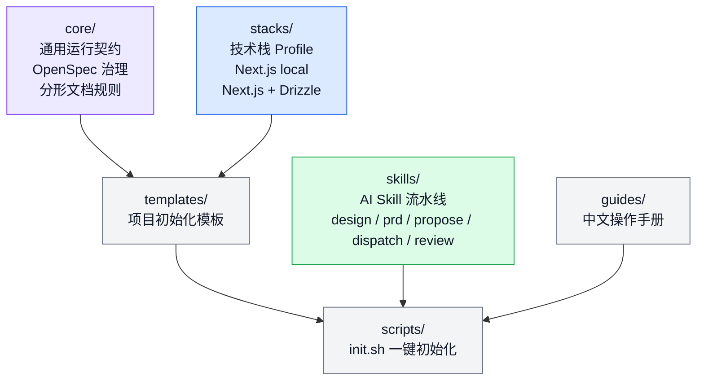
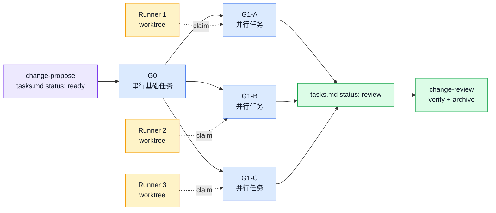

# General AI Spec


**AI 驱动的全流程软件开发框架**

作者：**jiatao**

> [!IMPORTANT]
> General AI Spec 的目标不是写一组 prompt，而是把 AI Agent 纳入可追踪、可并发、可验证、可归档的软件工程流程。

General AI Spec 是一套三层架构的 AI 编码框架，将产品需求管理、规范治理（OpenSpec）、分形文档、GitHub PR、CI 与 runner-agnostic 自动执行整合为一条交付流水线。它让 Claude Code / Codex 等交互式 agent 负责规划与审查，让 Codex Automation、Claude Code `/loop`、cron、GitHub Actions 等 runner 负责自动执行，从一行想法推进到代码合并与规格归档。

---

## 3 分钟看懂

```mermaid
flowchart LR
  A["原始输入<br/>design/inputs"] --> B["模块设计<br/>module-designer"]
  B --> C["Backlog<br/>B-NNN + M-NNN"]
  C --> D["PRD<br/>prd-writer"]
  D --> E["OpenSpec 四件套<br/>change-propose"]
  E --> F["自动执行<br/>change-dispatch"]
  F --> G["审查归档<br/>change-review"]
  G --> H["交付完成<br/>code + specs + backlog done"]

  classDef input fill:#FEF3C7,stroke:#F59E0B,color:#111827;
  classDef product fill:#DBEAFE,stroke:#2563EB,color:#111827;
  classDef spec fill:#EDE9FE,stroke:#7C3AED,color:#111827;
  classDef exec fill:#DCFCE7,stroke:#16A34A,color:#111827;
  classDef done fill:#CCFBF1,stroke:#0F766E,color:#111827;

  class A,B input;
  class C,D product;
  class E spec;
  class F exec;
  class G,H done;
```



| 颜色 | 阶段 | 解决的问题 |
|---|---|---|
| 黄色 | 设计层 | 把模糊灵感收敛成模块边界和可执行 idea |
| 蓝色 | 产品层 | 用 backlog 和 PRD 固化 what / why |
| 紫色 | 规格层 | 用 OpenSpec 四件套定义 how 和验收场景 |
| 绿色 | 执行层 | 多 runner 自动领取任务、隔离实现并 push |
| 青色 | 审查层 | PR 审查、三维 verify、delta specs 同步与归档 |

> [!NOTE]
> 框架最重要的设计是“需求链路 + 规格治理 + Git 隔离 + 分形文档 + 三维验证”。它关注的是 AI 编码在真实项目里的可控性，而不是单次生成速度。

---

## 为什么需要它

直接让 AI 写代码常见的问题：

- 需求来源不清晰，代码无法反查为什么做。
- 模块边界缺失，AI 容易把一个需求越改越大。
- 缺少规格约束，PRD、技术方案、测试和代码互相脱节。
- 多个 AI runner 同时工作时，任务领取、分支、冲突和归档缺少统一协议。
- 长流程中断后，难以恢复到正确状态。

General AI Spec 的处理方式：

| 问题 | 框架机制 |
|---|---|
| 需求漂移 | PRD approved 门控 + OpenSpec proposal / delta specs |
| 结构漂移 | 分形文档：每个目录 `_DIR.md`，关键文件 `@input/@output/@pos` |
| 并发混乱 | feature branch + worktree + tasks.md claim 状态 |
| 无法追踪 | `design inputs -> module -> backlog -> PRD -> change -> PR -> archive` |
| 无法收尾 | `change-review` 单轮闭环（审查→合并→verify→archive）+ 断点续跑 |

---

## 三层架构



| 层 | 目录 | 职责 |
|---|---|---|
| 通用规则层 | `core/` | Agent 行为规范、OpenSpec 治理规则、分形文档规范、Git 安全边界 |
| 技术栈配置层 | `stacks/` | 可插拔 stack profile，定义架构、依赖、禁令、初始化脚本 |
| AI Skill 层 | `skills/` | 串联设计、PRD、规划、自动执行、审查归档五个阶段 |

---

## 五层产物链路

| 层级 | 路径 | 产物 | 谁维护 |
|---|---|---|---|
| L0 | `design/inputs/` | 原始灵感、访谈、Figma、brainstorming | 人工录入 |
| L1 | `design/modules/` | `M-NNN` 模块边界、依赖、对外接口 | `module-designer` |
| L2 | `product/backlog.md` | `B-NNN`，带模块列、type、阶段、依赖 | `module-designer` / 后续 skill |
| L3 | `product/prd/` | `PRD-NNN`，回答 what / why | `prd-writer` + 用户 approved |
| L4 | `openspec/changes/` | 四件套 + feature branch + Draft PR | `change-propose` / dispatch / review |

核心原则：**1 backlog : 1 PRD : 1 change : 1 feature branch : 1 PR**。跨模块需求必须在设计层拆分。

---

## 五个核心 Skill

| Skill | 阶段 | 角色 | 主要输出 |
|---|---|---|---|
| `module-designer/` | 设计层 | 交互式 agent | 模块文档、拆分后的 backlog、roadmap AUTO 段 |
| `prd-writer/` | 产品层 | 交互式 agent | `PRD-NNN.md`、backlog `idea -> exploring` |
| `change-propose/` | 规格层 | 交互式 agent，可定时扫描 | OpenSpec 四件套、feature branch、Draft PR |
| `change-dispatch/` | 执行层 | 任意 runner | 自动领取任务组、实现代码、push 到 feature branch |
| `change-review/` | 审查层 | 交互式 agent | PR 审查、三维 verify、specs 同步、archive、backlog done |

> [!TIP]
> `change-dispatch` 是 runner-agnostic：只要求运行环境具备 git、shell 和网络。它不关心由 Codex Automation、Claude Code `/loop`、cron、GitHub Actions 还是一次性手动触发。

---

## Change 四件套

每个 change 都必须包含 OpenSpec 四件套，技术方案和代码一起进入 feature branch 与 Draft PR。

```text
openspec/changes/<change-id>/
├── _DIR.md          # change 目录说明
├── proposal.md      # Intent / Scope / Approach / Impact
├── specs/           # Delta Specs: ADDED / MODIFIED / REMOVED
├── design.md        # 文件清单、接口设计、并行计划、冲突矩阵
└── tasks.md         # 任务组、执行模式、状态机
```

| 文件 | 回答的问题 |
|---|---|
| `proposal.md` | 为什么做、做什么、不做什么、怎么做 |
| `specs/` | 哪些行为被新增、修改、移除，用 Given/When/Then 验证 |
| `design.md` | 要改哪些文件，如何并行，哪些文档要同步 |
| `tasks.md` | 哪些任务由 runner 自动做，哪些留给 review 或人工 |

---

## 并发执行模型



- G0/G1/G2 是逻辑任务组，不是子分支。
- 所有任务组提交到同一个 `<branch-prefix>/<change-id>` feature branch。
- runner 领取任务时把任务组 `pending -> executing` 并 push，作为轻量分布式锁。
- worktree 用于隔离并行执行，push 前通过 rebase 合并提交序列。
- dispatch 只执行自动化任务，不审查、不归档、不修改 main 治理层。

---

## 状态机

| 维度 | 状态流转 | 说明 |
|---|---|---|
| Backlog | `idea -> exploring -> proposed -> done` | 产品视角，main 上的高层状态 |
| PRD | `draft -> reviewing -> approved -> superseded` | 产品文档状态，approved 后才能 propose |
| Change | `draft -> ready -> executing -> review -> done` | 执行视角，写在 `tasks.md` YAML 头 |
| Task Group | `pending -> executing -> done` | runner 领取和完成任务组 |
| Module | `planning -> active -> done / deprecated` | 模块生命周期，roadmap AUTO 段同步 |

> [!WARNING]
> dispatch 阶段禁止修改 main 上的共享治理文件，例如 `product/backlog.md`、`openspec/specs/**`、`openspec/project.md`、`design/roadmap.md`。这些变更由 `change-review` 在 main 上串行处理。

---

## 分形文档

分形文档让 AI Agent 在局部目录里快速恢复上下文，降低“改错位置”和“重复造轮子”的概率。

| 规则 | 用途 |
|---|---|
| 每个目录维护 `_DIR.md` | 说明目录职责、子目录分工、关键入口 |
| 关键文件维护 `@input/@output/@pos` | 说明文件输入、输出和在当前层级中的位置 |
| 文档同步是实现的一部分 | 新建目录、新增关键文件、结构变化时同步更新 |
| 单文件不超过 300 行 | 降低上下文负担，方便 AI 与人类审查 |

示例：

```ts
/**
 * @input Validated request payload and provider configuration.
 * @output Structured extraction result for the API caller.
 * @pos Route-level orchestration for AI extraction.
 */
```

---

## 快速开始

### 1. 初始化项目

```bash
bash scripts/init.sh --stack nextjs-react-local --dir ./my-app
```

可用 stack：

```bash
bash scripts/init.sh --list
```

预览模式：

```bash
bash scripts/init.sh --stack nextjs-react-local --dry-run
```

### 2. 选择 dispatch runner

任选一种：

| Runner | 场景 |
|---|---|
| Claude Code `/loop <interval> /change-dispatch` | 开发期零配置 |
| Codex Desktop Automation | 24/7 无人值守，推荐 worktree |
| cron | 服务器轻量定时 |
| GitHub Actions | 零本地依赖 |
| 手动 `/change-dispatch` | 排查、补跑、试运行 |

### 3. 录入灵感并拆成 backlog

```text
design/inputs/brainstorming/<topic>.md
```

然后在 Claude Code 或 Codex 中运行：

```text
/design
```

### 4. 推进开发

```text
/prd B-001
# 用户审阅并将 PRD 标记为 approved
/change-propose B-001
# dispatch runner 自动执行
/change-review
```

---

## 技术栈 Profile

| Profile | 适用场景 | 技术基线 |
|---|---|---|
| `nextjs-react-local/` | 移动优先工具类 MVP，本地单用户 | Next.js 16、React 19、TypeScript、Tailwind、localStorage |
| `nextjs-react-drizzle/` | 全栈 AI SaaS、多用户、持久化 | Next.js 16、React 19、Drizzle、PostgreSQL、LangGraph、SSE |

每个 profile 包含：

- `stack.md`：技术栈描述和架构约定
- `do-not.md`：技术栈特定禁令
- `config-ext.yaml`：OpenSpec 规则扩展
- `scaffold.sh`：依赖安装和环境配置脚本

---

## 目录结构

```text
general_ai_spec/
├── core/           # 通用规则层
├── stacks/         # 技术栈配置层
├── skills/         # AI Skill 层
├── templates/      # 项目初始化模板
├── scripts/        # 自动化脚本
└── guides/         # 中文操作指南
```

---

## 文档导航

| 文档 | 内容 |
|---|---|
| [guides/00-overview.md](guides/00-overview.md) | 流水线全景、状态流转、工具分工 |
| [guides/01-initialization.md](guides/01-initialization.md) | 项目初始化步骤和 runner 配置 |
| [guides/02-backlog.md](guides/02-backlog.md) | 产品 Backlog 管理 |
| [guides/03-prd.md](guides/03-prd.md) | 从 backlog 到 PRD |
| [guides/04-propose.md](guides/04-propose.md) | 从 approved PRD 到 OpenSpec 四件套 |
| [guides/05-execution.md](guides/05-execution.md) | dispatch 自动执行、并行机制、异常处理 |
| [guides/06-review-and-archive.md](guides/06-review-and-archive.md) | 审查、三维 verify、归档 |
| [guides/07-status-protocol.md](guides/07-status-protocol.md) | 状态字段和生命周期 |
| [guides/08-faq.md](guides/08-faq.md) | 常见问题 |
| [guides/09-git-github-workflow.md](guides/09-git-github-workflow.md) | Git / GitHub 全流程 |
| [guides/10-extras.md](guides/10-extras.md) | 外部 skill 弱耦合接入 |
| [guides/11-task-types.md](guides/11-task-types.md) | feature / bug / chore / hotfix 类型规则 |
| [guides/12-design-layer.md](guides/12-design-layer.md) | 设计层、模块生命周期、roadmap |

---

## 设计原则

- **产品驱动**：所有开发从 design inputs 收敛到模块化 backlog，PRD 定义 what / why，四件套定义 how。
- **人工门控**：PRD 必须由用户 approved，AI 不替代人做产品决策。
- **规范治理**：每个 change 必须包含 proposal、delta specs、design、tasks。
- **并行优先**：任务按依赖关系拆成串行 / 并行组，runner 在 worktree 中隔离执行。
- **分形文档**：目录和关键文件自带局部上下文，文档同步是实现的一部分。
- **三维验证**：Completeness、Correctness、Coherence 缺一不可。
- **可插拔**：core 规则通用，技术栈通过 stacks 切换，skill 可独立演进。
- **可恢复**：STOP / WARN 写入 `.logs/`，propose / review 支持半发布恢复与归档恢复。

---

## License

MIT
